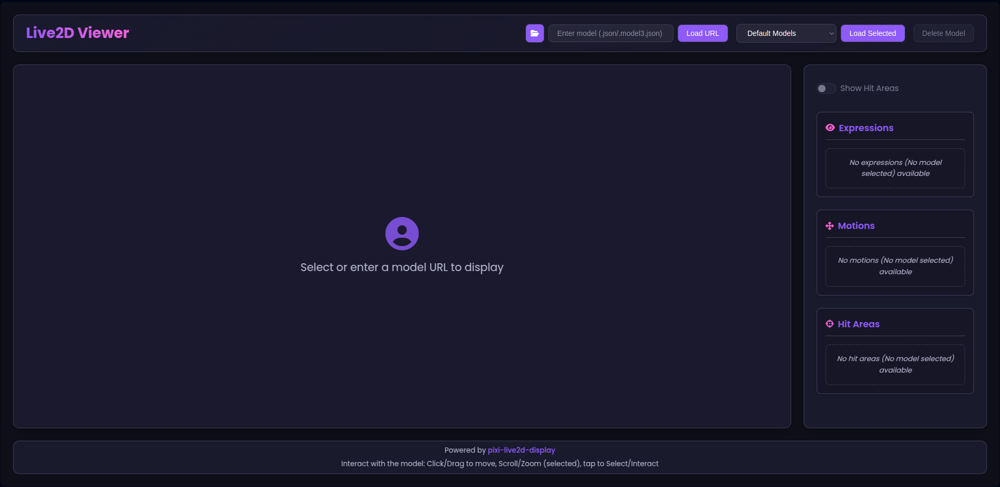
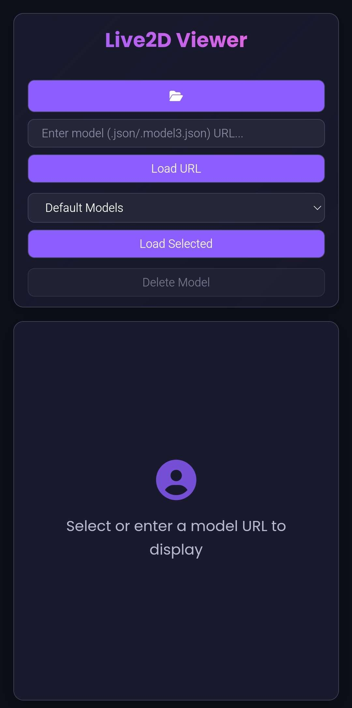
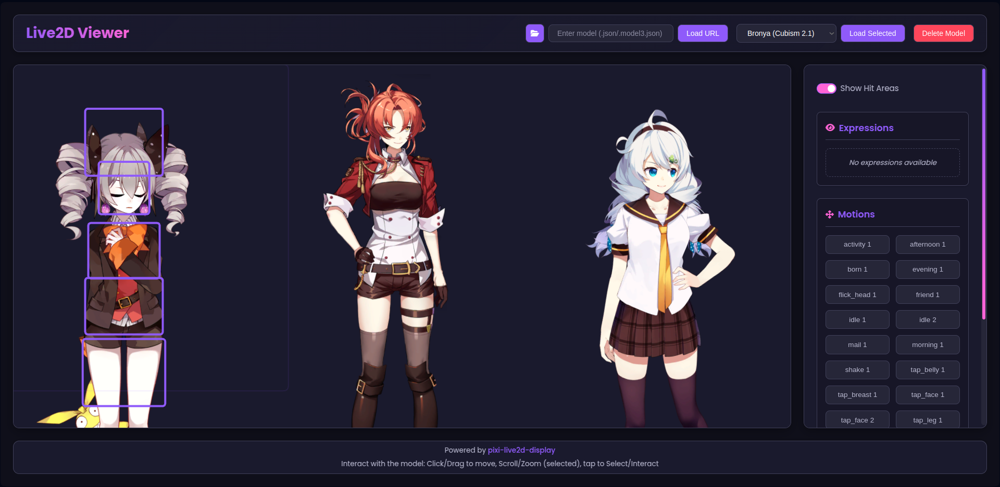
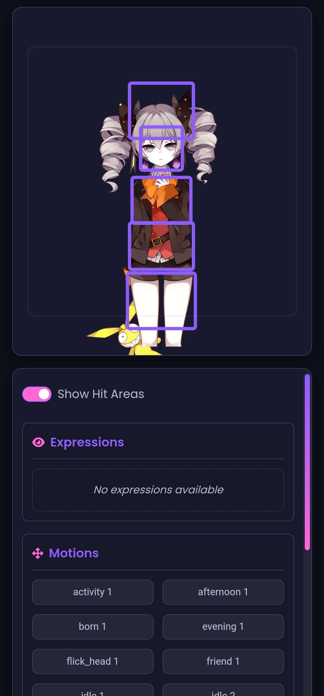
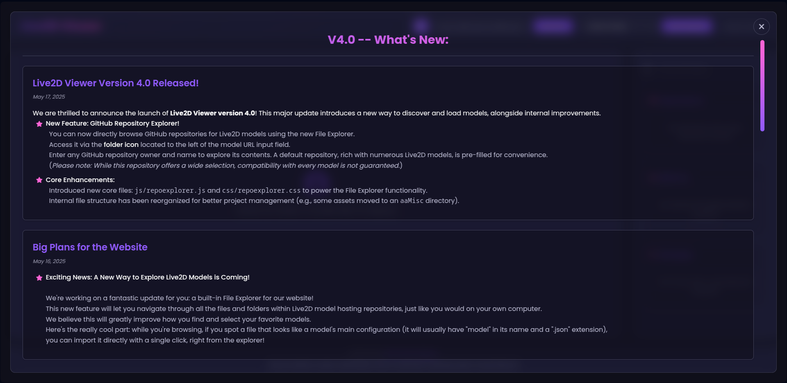
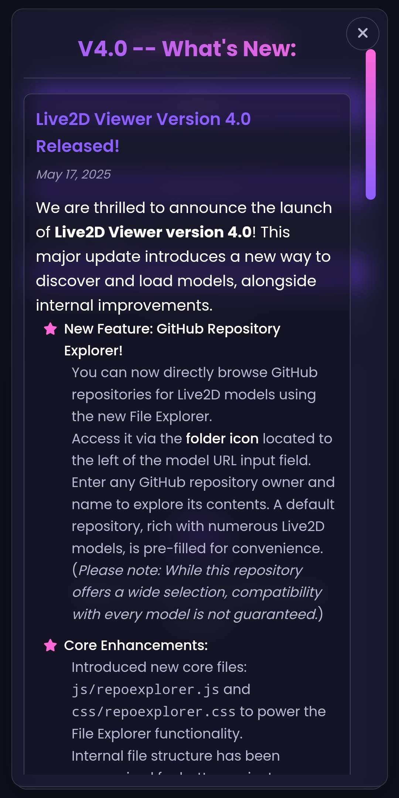
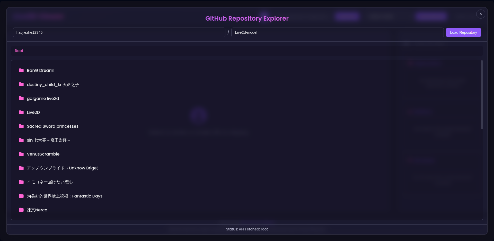
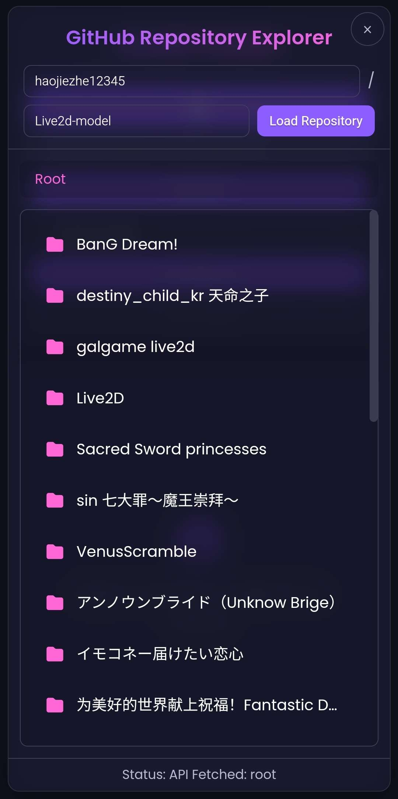

<!-- in your README.md -->
<h1>
  
  <strong>Live2D Viewer</strong>
</h1>

A browser‑based Live2D viewer that lets you load and interact with one or more Live2D models in real time.  
Built with plain HTML, CSS, and JavaScript, it supports touch gestures, dynamic controls, and a convenient “What’s New” changelog modal.

---

## Table of Contents

- [Preview](#demo)  
- [Features](#features)  
- [Installation](#installation)  
- [Usage](#usage)  
- [Changelog Modal](#changelog-modal)  
- [Configuration & Assets](#configuration--assets)  
- [Contributing](#contributing)  
- [License](#license)

---

## Preview

Live Preview: [https://imduck42.github.io/Live2D-Viewer](https://imduck42.github.io/Live2D-Viewer)  
<details>
<summary>Screenshots</summary>


|


  


|


</details>

---

## Features

- **Multi‑Model Support**  
  * Load and manage multiple Live2D models simultaneously on the canvas.  
- **Touch & Mouse Controls**  
  * Pinch‑to‑zoom, drag, and click on hit areas to trigger motions and expressions.  
- **Dynamic UI Panel**  
  * Toggle and control model parameters (motions, expressions, hit‑area visualizations) via a responsive sidebar.  
- **Responsive Design**  
  * Works on both desktop and mobile devices with adaptive layouts.  
- **Changelog Modal**  
  * Built‑in “What’s New” modal (glassmorphism style) that dynamically loads your latest updates.  
- **No Frameworks**  
  * Only uses the official Live2D Cubism libraries plus vanilla JS — no frameworks required.

---

## Installation

1. **Clone the repository**  
   ```bash
   git clone https://github.com/ImDuck42/Live2D-Viewer.git
   cd Live2D-Viewer
    ```

2. **Open in browser**
   Simply open `index.html` in any modern browser (Chrome, Firefox, Edge, Safari).

3. **(Optional) Serve locally**
   If you want to serve via HTTP (recommended for model loading):

   ```bash
   # Using Python 3.x
   python3 -m http.server 8000
   # Then open http://localhost:8000 in your browser
    ```

---

## Usage

1. **Load a model**

   * Enter the url of a `.model(3).json` file or select one of the `default models` .
2. **Interact**

   * **Click** on defined hit areas to trigger motions.
   * **Drag** to move the model around.
   * **Pinch** (or scroll) to zoom in/out.
3. **UI Controls**

   * Use the sidebar to toggle hit‑area outlines, switch expressions, and play predefined motions.
   * Click the site title to open the changelog modal.

---

## Changelog Modal

A modal that lists the project’s latest commits and updates.

* **Location**: `assets/changes.html` (and embedded directly in `index.html`)
* **Dynamic Loading**: Fetches `changes.html` on demand so I didn't have to rewrite the main page.
* **Styling**: Glassmorphism panel with accessible close button (Crazy ik).

---

## Configuration & Assets

* **CSS**:

  * `css/styles.css` — main styling and responsive rules
* **JavaScript**:

  * `js/script.js` — viewer logic, event handlers, UI initialization
* **Libraries** (`libs/`):

  * `live2d.min.js`, `live2dcubismcore.min.js` — the official Live2D runtimes
  * `js/extra.js` — hit‑area styling, utility functions (modification from the original)
* **Assets**:

  * `assets/` — site icon and changes.html

---

## Contributing

Contributions are welcome! Please open an issue or submit a pull request with:

1. A clear description of the change.
2. Relevant screenshots or code snippets.
3. Tests (if applicable).

Please follow the existing code style conventions.

---

## License

This project is licensed under the [MIT License](LICENSE). Feel free to use, modify, and distribute as you see fit.